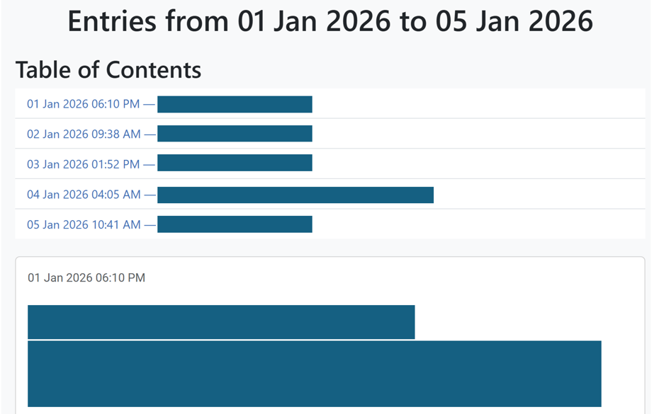
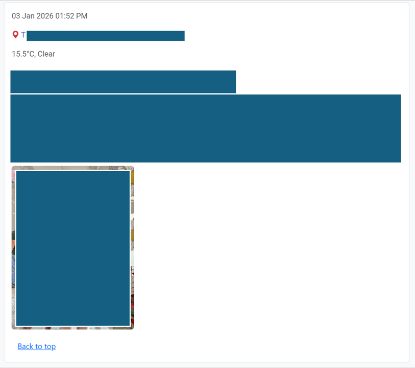

# DayOneJSONtoHTML
This is a Python script that converts the exported JSON Day One journal entries into a single HTML file.

The output HTML file extracts the following information from the JSON file:
- Date and time of entry
- The latitude and longitude, which are used to create a Google Maps link
- Temperature and weather conditions
- Main text
- Photos, videos and audios

## Screenshots

